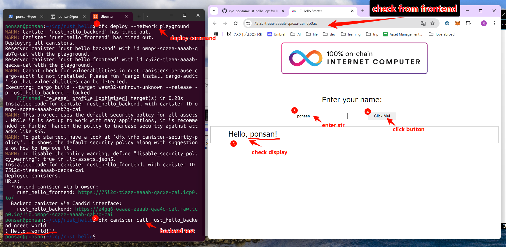
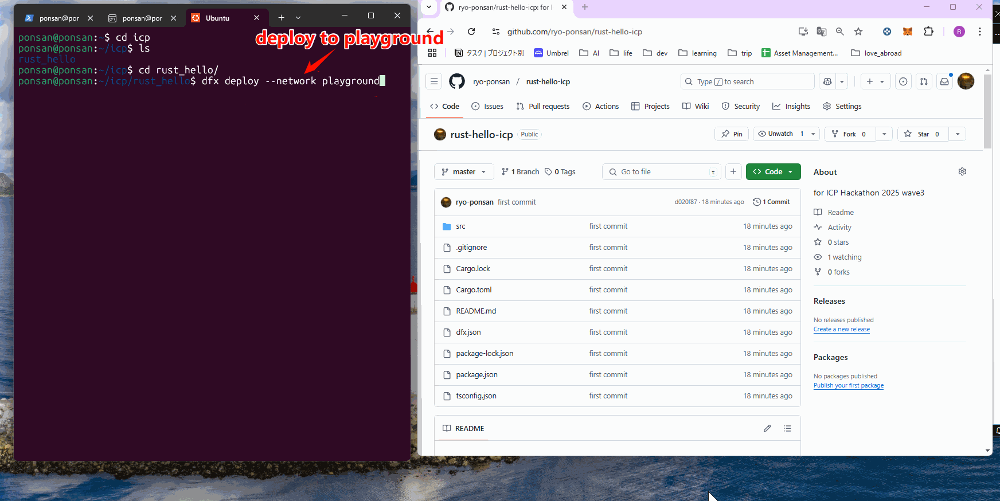

# Playgroundに配置しました - Rust Hello World ICP プロジェクト

## 概要
本プロジェクトは、Rustで作成したシンプルな「Hello, world!」キャニスターです。  
キャニスターの `greet` 関数を呼び出すと、"Hello, world!" というメッセージが返されます。  
なお、今回のデプロイはInternet Computer Playgroundを利用して行いました。

---

## デプロイ手順の説明

### 1. プロジェクトの作成
以下のコマンドを実行して、Rustのサンプルキャニスターを作成しました。
```bash
dfx new rust_hello --type=rust
cd rust_hello
```

### 2. Playgroundへのデプロイ
1. プロジェクトディレクトリに移動後、以下のコマンドでPlayground用のネットワークへデプロイを実行しました。
   ```bash
   dfx deploy --network playground
   ```
2. コマンド実行後、ターミナルログにキャニスターIDが表示されます。  
   このキャニスターIDは、実際にデプロイが成功した証拠となります。  

---

## 簡単な動作確認ガイド

### バックエンドキャニスターの確認
1. ターミナルで以下のコマンドを実行し、`greet` 関数の動作をテストしました。
   ```bash
   dfx canister call rust_hello_backend greet world
   ```
2. 正常動作の場合、以下のような出力が得られます。
   ```
   "Hello, world!"
   ```
   この出力により、キャニスターが正しく機能していることを確認できます。

### フロントエンドキャニスターの確認
- デプロイ時に表示されたURL（例：`https://75i2c-tiaaa-aaaab-qacxa-cai.icp0.io/`）にブラウザでアクセスし、画面の表示を確認しました。  
- こちらの画面キャプチャ、動画キャプチャも、動作確認の証拠として保存しています。

#### 画面キャプチャ


#### 動画キャプチャ

[youtube](https://youtu.be/WJJOxdVAgU4)

---

## 提出内容

今回の提出物には以下の内容が含まれています：

- **「Playgroundへ配置した」という証拠**  
  - ターミナルログのスクリーンショットおよびフロントエンドキャニスターのUI画面キャプチャ
- **GitHubリポジトリリンク**  
  - プロジェクトのソースコードとこのREADMEを含むリポジトリのURL
- **デプロイ手順の説明および動作確認ガイド**  
  - 本READMEに記載済み

---

## GitHubリポジトリ

プロジェクトのコードとドキュメントは本リポジトリで管理しています：  
[https://github.com/ryo-ponsan/rust-hello-icp](https://github.com/ryo-ponsan/rust-hello-icp)  